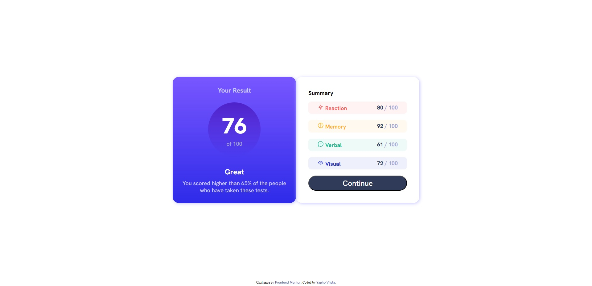

# Frontend Mentor - Results summary component solution

This is a solution to the [Results summary component challenge on Frontend Mentor](https://www.frontendmentor.io/challenges/results-summary-component-CE_K6s0maV). Frontend Mentor challenges help you improve your coding skills by building realistic projects. 

## Table of contents

- [Overview](#overview)
  - [The challenge](#the-challenge)
  - [Screenshot](#screenshot)
  - [Links](#links)
- [My process](#my-process)
  - [Built with](#built-with)
  - [What I learned](#what-i-learned)
  - [Continued development](#continued-development)
  - [Useful resources](#useful-resources)
- [Author](#author)

## Overview

### The challenge

Users should be able to / Os usuários serão capazes de:

- View the optimal layout for the interface depending on their device's screen size
- See hover and focus states for all interactive elements on the page

- Visualizar o site com o layout ideal para seu tamanho de tela
- Ver os estados de foco de todos os elementos interativos da página

### Screenshot

### Links

- Solution URL: [Code](https://github.com/yagho05/results-summary-component)
- Live Site URL: [Site](https://yagho05.github.io/results-summary-component/)

## My process

### Built with

- Semantic HTML5 markup
- CSS custom properties
- Flexbox
- CSS Grid
- Mobile-first workflow

### What I learned

In this project I was able to challenge myself more with CSS Flexbox and improve my responsive design.

Nesse projeto consegui me desafiar mais com o CSS Flexbox e aprimorar mais meu design responsivo.

### Continued development

I want to continue improving myself with Flexbox and continue learning new technologies like Grid Layout and starting to study programming languages ​​like JavaScript.

Quero continuar me aprimorando com o Flexbox e continuar aprendendo novas tecnologias como o Grid Layout e começar o estudo de linguagens de programação como o JavaScript.

### Useful resources

- [Flexbox](https://css-tricks.com/snippets/css/a-guide-to-flexbox/) - This is an amazing article which helped me finally understand Flexbox. I'd recommend it to anyone still learning this concept.

## Author

- Website - [Yagho Vilela](https://github.com/yagho05)
- Frontend Mentor - [@yagho05](https://www.frontendmentor.io/profile/yagho05)
- Twitter - [@YaghoVilela](https://twitter.com/YaghoVilela)